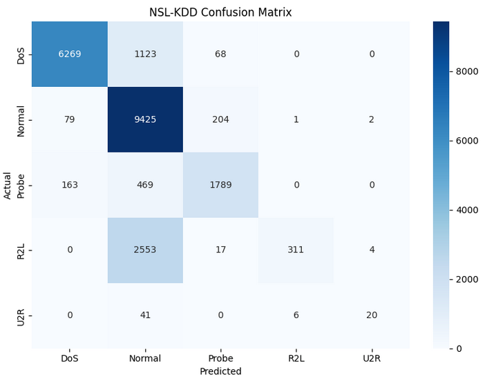

# **Assignment Report** 

Course: Advanced Python (ICS0019)

Team members: Rasmus Simson, Mares Vassiljev

Date: 23.05.2026

Repository link: \[GitHub, GitLab or other public online repository\]

### 1\. Approach

#### 1.1 Strategy Overview

Our initial plan was just to throw a Random Forest model at the dataset and see what happened. When we realized that method completely ignored the rare attacks (like R2L and U2R), our new strategy became figuring out how to force the model to pay attention to them. We decided to use SMOTE to generate fake data for the rare classes and switch to XGBoost, since it generally handles imbalanced data better than standard decision trees.

#### 1.2 Preprocessing

Feature engineering: We dropped the level column and the num\_outbound\_cmds column (since it didn't have useful variance). We then mapped the 39 specific attack names into the 5 main categories required.

Feature selection: We used LabelEncoder to convert the categorical text columns (protocol\_type, service, flag) into numbers so the model could process them.

Scaling: We didn't bother with StandardScaler, since tree-based models like XGBoost don't really care about feature scaling.

Other: no

#### 1.3 Class Imbalance Handling

How did you address the imbalance between classes? 

Method used: We used SMOTE combined with balanced sample weights.

Parameters: We set SMOTE to artificially boost the R2L class to 5,000 samples and the U2R class to 2,000 samples (k\_neighbors=5). 

Effect on training set distribution: Before doing this, the rare classes were so small the model just predicted "Normal" for everything. After applying SMOTE, the dataset had enough examples of R2L and U2R for the model to actually learn their patterns. 

### 2\. Experiments

Always document experiments you ran. Fill in the summary table will all the experiments. Add the descriptions for the ones you find important.

#### Total number of experiments: 

#### Experiment 1: Baseline run

Algorithm: Random Forest Classifier

What changed from baseline: We added class\_weight='balanced' to see if algorithmic weighting would fix the imbalance on its own.

Macro F1 (CV): \~0.85

Macro F1 (test): 0.4784

Observation: The model was really good at finding DoS and Normal traffic, but it got zero correct predictions for R2L and U2R. Just balancing the weights wasn't enough.

#### Experiment 2: XGBoost Classifier

Algorithm: XGBoost Classifier

What changed: We switched to XGBoost (still using balanced sample weights) to see if it could catch the rare attacks. We did not use SMOTE yet.

Macro F1 (CV): \~0.88

Macro F1 (test): \~0.52

Observation: The score went up slightly, and the model started catching a tiny handful of R2L attacks, but U2R was still completely ignored. We realized algorithmic changes alone wouldn't solve the problem.

#### Experiment 3: SMOTE Testing

Algorithm: Random Forest Classifier

What changed: We went back to our original Random Forest model but applied SMOTE to the training data first to boost the R2L and U2R classes.

Macro F1 (CV): \~0.90

Macro F1 (test): \~0.56

Observation: Adding fake data for the rare classes made a huge difference. The model finally started recognizing the patterns of R2L and U2R

#### Experiment 4: Final Model

What changed: We combined our best algorithm (XGBoost) with our best data strategy (SMOTE) and tuned the hyper-parameters (max\_depth=8, learning\_rate=0.1).

Macro F1 (CV): 0.9467 

Macro F1 (test): 0.6272 

Observation: Giving the XGBoost algorithm enough fake data to study allowed it to classify the rare attacks, which helped us pushing our test score of past 0.62.

#### Experiments Summary

| \# | Description | Algorithm | Imbalance Handling | Macro F1 (CV) | Macro F1 (test) |
| ----- | ----- | ----- | ----- | ----- | ----- |
| 1 | Baseline Attempt | Random Forest  | class\_weight='balanced' | \~0.85 | 0.4784 |
| 2 | XGBoost Classifier | XGBoost  | sample weights | \~0.88 | \~0.5200 |
| 3 | SMOTE Testing  | Random Forest  | SMOTE \+ class\_weight | \~0.90 | \~0.5600 |
| 4 | Final Model | XGBoost  | SMOTE \+ sample weights | 0.9467 | 0.6272 |

### 3\. Final Results

#### 3.1 Best Model

Algorithm: XGBoost

Key parameters: n\_estimators=400, max\_depth=8, learning\_rate=0.1, subsample=0.8, colsample\_bytree=0.8, tree\_method=’hist’, random\_state=42

Imbalance handling: SMOTE (R2L \- 5,000; U2R \- 2,000; k\_neighbors=5) \+ compute\_sample\_weight(’balanced’)

Feature engineering: None

#### 3.2 Final Macro F1-Score

| Metric | Score |
| ----- | ----- |
| Macro F1 (test) | 0.6272 |
| Macro F1 (CV) | 0.9467 \+/- 0.0103 |

#### 3.3 Classification Report

#### 

| Category | Precision | Recall | F1-Score | Support |
| ----- | ----- | ----- | ----- | ----- |
| Normal | 0.6925 | 0.9705 | 0.8082 | 9711 |
| DoS | 0.9628 | 0.8403 | 0.8974 | 7460 |
| Probe | 0.8609 | 0.7390 | 0.7953 | 2421 |
| R2L | 0.9780 | 0.1078 | 0.1942 | 2885 |
| U2R | 0.7692 | 0.2985 | 0.4301 | 67 |

#### 3.4 Confusion Matrix

### 4\. Cross-Validation vs. Test Score

CV macro F1: 0.9467 \+/- 0.0103

Test macro F1: 0.6272

Gap: 0.3195

Analysis: The gap is large but expected. KDDTest+ contains attack types that were not included in training like R2L attacks. Because of this, the model struggles to recognise these new patterns. So, the difference between CV and test scores is mainly caused by the harder test set. The CV score measures performance on known attack patterns, while the test score measures how well the model handles new, unseen attacks, similar to real-world IDS and zero-days. If the CV score had been lower than the test score, it could suggest data leakage.

### 5\. What Worked and What Didn't

#### What had the biggest positive impact?

Using SMOTE had the biggest effect. It helped the model finally detect rare attacks like R2L and U2R. For example, U2R F1-score improved from 0.03 to 0.42, and R2L from 0.00 to 0.23. This also increased the overall macro F1-score a lot.

#### What surprisingly didn't help?

Using only class class\_weight='balanced' was not enough. The model still mostly ignored the rare attack classes because there were too few real examples of them in the dataset. 

#### What would you try with more time?

We would try deeper hyperparameter tuning, ensemble methods, and more feature engineering. We would also test newer anomaly detection approaches to improve detection of unseen attack types. 

### Appendix: Environment

Hardware: Colab T4 GPU

Python version: 3.12.13

Key libraries: pandas: 2.2.2, numpy: 2.0.2, sklearn: 1.6.1, xgboost: 3.2.0, imblearn: 0.14.1, matplotlib: 3.10.0, seaborn: 0.13.2, scipy: 1.16.3

Random seed: 42